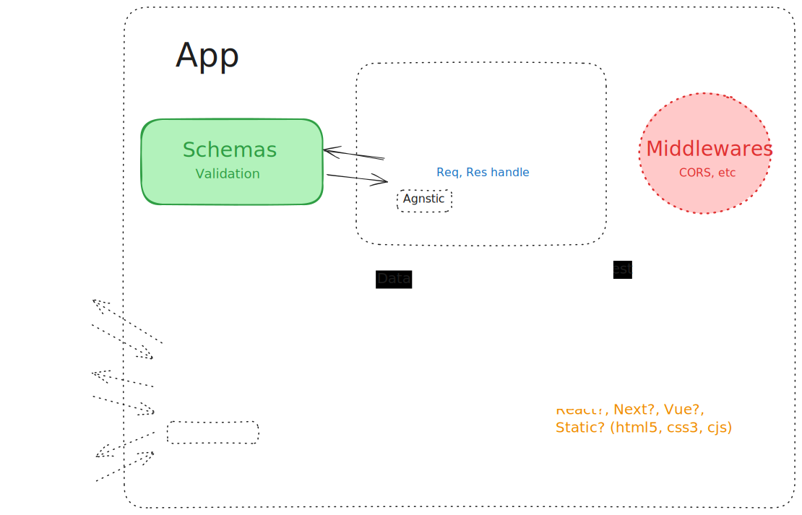

<h2>Another MVC API with express, zod, cors etc.</h2>

<b>What we got here:</b>

- An API built with node, express, Zod, Cors ready to work with MongoDB, MySQL or local JSON Models 

- An express router that calls the controller to handle the petitions.

<b>Arquitecture principles:</b>

- Each of the layers are separated and the Controller are agnostic of the interfase use in the model or the views.

- The API implements the schema valiadted via Zod that all the models must fulfill regardless of its representations

- That way we can switch th emodel, scale the resources keeping the statless with separated concepts. 

